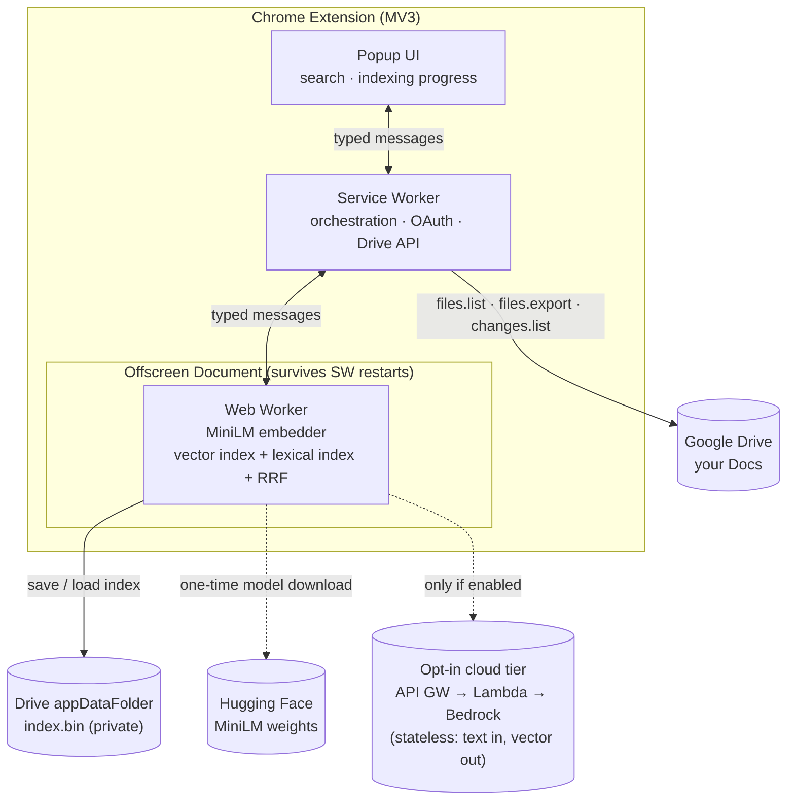

# Drive Semantic Search

Meaning-based search over your Google Docs, as a Manifest V3 Chrome extension —
**without any third-party server ever holding your content.**

Type *"money our clients still owe us"* and it finds `invoice_2024_Q3_final`,
even though the doc never uses those words. Type the exact filename and it finds
that too. Click a result to open the doc — from the popup, or straight from the
address bar (`drv hiring budget`).

## The thesis

A search index does not require a shadow copy of your data on someone else's
infrastructure. Everything that touches your document text happens **on your
device**:

- Documents are exported from Drive and **embedded on-device** by a MiniLM
  sentence-transformer (transformers.js + ONNX Runtime Web). (An [opt-in
  cloud tier](#the-opt-in-cloud-tier) exists for higher-quality embeddings —
  itself stateless, storing nothing.)
- The index — vectors **and** text — is searched locally.
- The only place the index is *stored* is **your own Google Drive**, in a
  hidden app-scoped folder (`appDataFolder`). That makes it durable, private,
  and automatically synced across your devices, with **zero infrastructure
  owned by this project.**

No account to create, no server to trust, no content leaving your control.

## How it works



**Indexing pipeline.** Authenticate (`chrome.identity`) → list Docs
(`files.list`) → export each as Markdown (`files.export`, with backoff +
concurrency cap) → chunk on heading/paragraph structure (with heading
breadcrumbs and overlap) → embed on-device in length-sorted batches. The model
runs in a Web Worker inside an **offscreen document**, so it stays warm across
MV3 service-worker restarts and never blocks a UI thread. WebGPU is used when
available, with a WASM fallback.

**Retrieval is hybrid.** A flat float32 vector index (brute-force cosine —
[measured](docs/benchmarks.md) at <16 ms over 60k×384, ample at personal-Drive
scale) is fused with a [MiniSearch](https://github.com/lucaong/minisearch)
lexical index via **reciprocal rank fusion** (k=60). So exact-name lookups and
fuzzy conceptual queries both work, and neither has to win alone. Results are
collapsed to one hit per document with a breadcrumb and snippet.

**Persistence & durability.** The index is int8-quantized (per-vector scale) +
gzipped text in a versioned, checksummed envelope, saved to `appDataFolder`.
It loads on startup and after sign-in — a fresh browser profile restores full
search with **zero re-embedding**. Concurrent edits from two devices reconcile
via Drive's `headRevisionId`: on a conflict we merge (union of docs,
last-write-wins per doc) rather than clobber.

**Incremental sync.** After the first index, the extension polls Drive's
`changes.list` feed (stored page-token cursor) on startup and on an alarm:
only modified docs are re-exported, and within a modified doc only chunks
whose text actually changed are re-embedded (content-hash diffing) — editing
one paragraph re-embeds ~1 chunk, not the doc. Deleted docs are removed from
the index.

## The opt-in cloud tier

The default is fully local — that's the thesis. But higher-quality embeddings
exist server-side, and an API credential can't ship inside an inspectable
extension bundle. So V2 adds an **opt-in** cloud tier that keeps the thesis
intact: a minimal AWS pipeline (API Gateway → Lambda → Amazon Bedrock,
Titan Text Embeddings V2, 1024-dim) that holds the credential server-side and
**persists nothing** — text in, vectors out, no request bodies even logged.
The Lambda's IAM role can do exactly two things: invoke that one Bedrock
model, and write its own CloudWatch logs. Your index still lives only in
your own Drive.

The embedder worker routes **per request** — every embedding (indexing, sync,
popup search, omnibox) flows through one router, so query and index vectors
always come from the same model. MiniLM-384 and Titan-1024 are different
embedding spaces: the index, its serialized envelope, and the load/merge
compat checks are all stamped with model + dims, and switching tiers wipes
and cleanly re-embeds rather than ever mixing spaces.

The endpoint is API-key-gated with usage-plan throttling and CloudWatch
alarms (5xx and abuse/throttle spikes → SNS). Deploys are infrastructure-as-
code (AWS SAM) via a GitHub Actions pipeline: PRs are test-gated, and a `v*`
tag deploys the stack hands-free through GitHub's OIDC federation — no
long-lived AWS keys anywhere. See [aws/README.md](aws/README.md) to stand up
your own.

## Retrieval quality

48 labeled queries over a 16-doc fixture corpus, split between exact-name
lookups and paraphrases. Reproduce with `npm run eval` (embeds with the shipped
model and drives the real retrieval code):

| mode | recall@1 | recall@5 | MRR |
|------|----------|----------|-----|
| lexical | 0.917 | 1.000 | 0.958 |
| semantic | 0.896 | 0.979 | 0.936 |
| **hybrid** | **1.000** | **1.000** | **1.000** |

Hybrid ranks the correct doc #1 on every query — RRF recovers what each single
mode misses. (recall@5 saturates at this corpus size, so recall@1 and MRR are
the discriminating metrics.) See [docs/benchmarks.md](docs/benchmarks.md).

## Getting started

```bash
npm install
npm run build      # outputs dist/
npm test           # unit tests
npm run eval       # retrieval quality numbers
```

1. Configure a Google OAuth client — see [docs/oauth-setup.md](docs/oauth-setup.md).
2. `chrome://extensions` → enable Developer mode → **Load unpacked** → select `dist/`.
3. Open the popup → **Connect Google Drive** → **Index my Docs**.

## Tech

TypeScript · esbuild · Manifest V3 (offscreen document + Web Worker +
omnibox) · transformers.js / ONNX Runtime Web (`Xenova/all-MiniLM-L6-v2`,
384-dim, pinned revision) · MiniSearch · Vitest. No UI framework — the popup
is vanilla TS. Cloud tier: AWS SAM · API Gateway · Lambda (Node 20, arm64) ·
Amazon Bedrock (Titan Text Embeddings V2) · CloudWatch/SNS · GitHub Actions
with OIDC deploys.

## Limitations & trade-offs

- **First-run cost.** Initial indexing embeds your entire corpus on-device —
  minutes for a large Drive — plus a one-time ~25 MB model download. It's
  resumable and runs in the background, and every later launch restores from
  Drive with no re-embedding.
- **Google Docs only.** Sheets, Slides, PDFs, and other Drive files are not
  indexed yet.
- **Cloud-tier throughput is quota-bound.** Bedrock invokes one text per call,
  and fresh AWS accounts get low request-per-minute quotas — the pipeline
  paces itself (adaptive retries, small batches) rather than failing, but a
  full cloud re-index of a large Drive takes a while. The local tier has no
  such ceiling, which is itself a point for the thesis.
- **Switching embedding tiers re-embeds everything.** By design: MiniLM and
  Titan vectors are different embedding spaces, and the index never mixes
  them.
